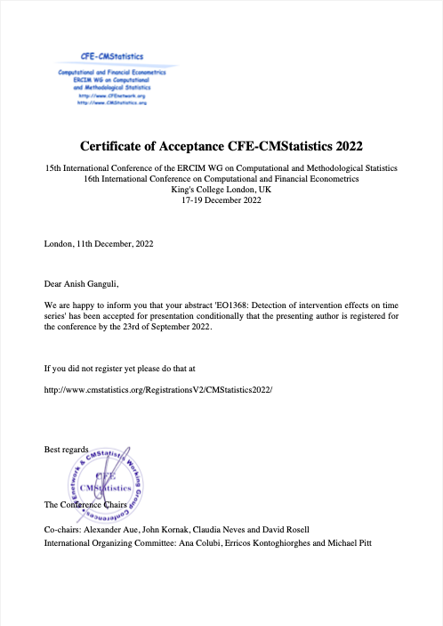
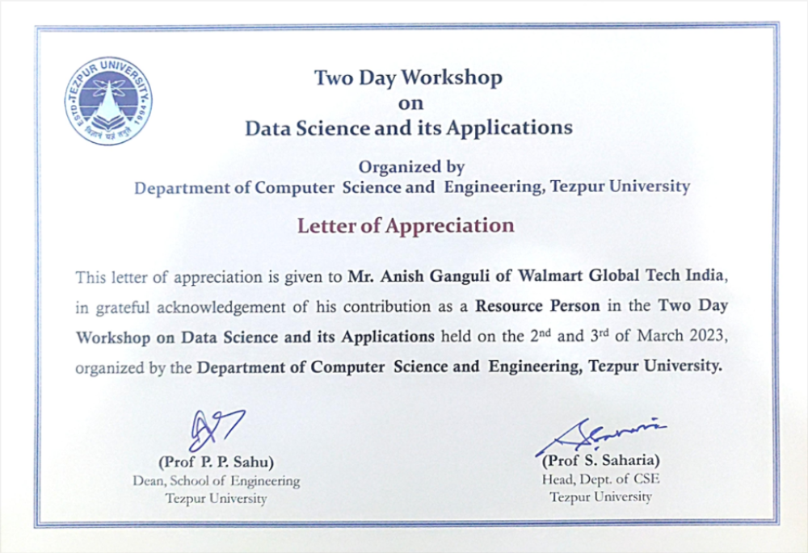

# <blue>**Anish Ganguli**</blue>
### <blue>_Data Scientist_</blue>

## <u>Contact</u>

Mail id :- [anish.analytics1@gmail.com](mailto:anish.analytics1@gmail.com)  
Phone :- +91 8420510608  
LinkedIn :- [LinkedIn Profile](https://www.linkedin.com/in/anish-ganguli-404b63107/)  
Location :- [Bengaluru, India](https://www.google.com/maps/@12.9332167,77.703669,18.82z/data=!5m1!1e1?entry=ttu)

## <u>Summary</u>

Data scientist with 5 years of robust corporate experience in various 
domains like Retail, Aviation, Credit Risk. Possesses relevant knowledge 
and skills to achieve target on time. Used to handling end-to-end projects 
including requirement gathering, building machine learning based solutions 
using Python, PySpark, as well as business insights generation from gathered 
requirements. Led a team of junior resources to solutionize and deliver 
end to end projects.

## <u>Experience</u>

- [**Walmart Global Tech India, Bengaluru**]([_Walmart Global Tech India_](https://www.linkedin.com/company/walmartglobaltechindia/mycompany/))
  > Data Scientist 
  >> Jun, 2021 - Present  
  >> Skills : PySpark, Python, Explainable AI, Time Series Forecasting, 
Deep Learning, Product Development
    - Involved in the development and deployment of multiple 
    <green>**business KPIs' (Markdown, Markup etc.)**</green> forecasting frameworks. 
    Due to the erratic nature of the time series data a lot of experimentation 
    was involved and finally we were able to reach the accuracy which was 
    justifiable for business in order to <green>**execute efficient business planning 
    for the next quarter in terms of monitoring the mentioned KPIs and 
    eventually retail stores revenue**</green>.
    - Developed a framework for Supply-Chain business to help with their labour 
    planning. The problem was to monitor a business KPI called CPH (Cases Per Hour) 
    and explain the impact of different business metrics on CPH. The framework 
    involved <green>**CPH prediction (with XGBoost) with an XAI (Explainable AI) layer**</green> 
    which helped business quantify the impact of different factors on CPH.
    - Involved in the development of <">**Zero Intermittent Sales Forecasting**</green> for a 
    separate entity within Walmart using 
    <green>**Time Series Characterization and LSTM**</green>.
  
 

- [**Ernst & Young, Bengaluru**](https://www.linkedin.com/company/ernstandyoung/)
  >Advanced Analyst 
  >> Jan, 2020 - Jun, 2021  
  >> Skills :  Machine Learning, Python, Excel
    - Supported in a Year-Ending Review and development engagement of IFRS9 
    Loss Rate Model with one of the biggest Saudi Audit clients. 
    Performed Exploratory Data Analysis to check the IFRS9 compliance of the 
    model and developed the model using <green>**Random Forest Algorithm**</green>. 
    This work for YE audit has helped on concluding on one of the most 
    significant findings which relate to Loss Rate Model development.

 
 

- [**ITC Infotech India Ltd., Bengaluru**](https://www.linkedin.com/company/itc-infotech/?originalSubdomain=in)
  > Associate Data Scientist 
  >> Aug, 2018 - Dec, 2019  
  >> Skills : Machine Learning, Statistical Modelling, Optimization, R
  - Developed a <green>**Beta–Geometric/NBD model**</green> to calculate the Churn Probability 
  of a customer of an Indian Airlines during a predefined period. 
  This model helped the client eventually determine the high value 
  customers and also help them provide proper promotional campaigns.

 

- [**Indian Statistical Institute, Kolkata**](https://www.isical.ac.in/)
  > Research Assisstant
  >> Sep, 2017 - Apr, 2018  
  >> Skills : Research, Applied Statistics, R
- Did extensive research on applied statistics especially on Robust Inference based parameter estimation approach.

## <u>Education</u>
- [University of Delhi, New Delhi](https://www.du.ac.in/)
  > M.Sc. in Statistics
  > > Aug, 2015 - Jun, 2017
  > 
- [St. Xavier's College, Kolkata](https://www.sxccal.edu/)
  > B.Sc. in Statistics
  > > Jul, 2012 - May, 2015

## <u>Talks & Presentation</u>
- [King's College, London](https://www.kcl.ac.uk/)
  > Presentation Date : Dec 19, 2022  
  > Topic : <green>**How to Detect Significance of Intervention Effects in Time Seires**</green>  
  > Certificate :  

- [University of Tezpur, Assam](http://www.tezu.ernet.in/)
  > Presentation Date : Dec 19, 2022  
  > Topic : <green>**Application of Data Science in Finance Domain**</green>  
  > Certificate :  

## <u>Awards & Recognitions</u>

 > 1. Team award for delivery excellence
  >> <blue>**Walmart Global Tech India**</blue>
 > 2. Bronze award in Data Science
  >> <blue>**Ernst & Young Global Delivery Services LLP**</blue>
 > 3. Recognition Award for Excellent Performance and Delivery
  >> <blue>**ITC Infotech India Ltd.**</blue>

